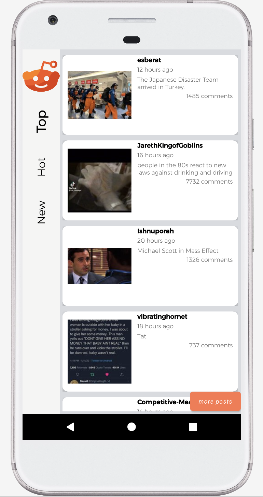

<h2>   Top Reddit  App </h2>

This is a simple user-friendly android app with top Reddit publications from https://www.reddit.com/top  

**Main features:**  

🔸 Publication  
 - the author  
 - created date in the format "X hours ago" 
 - post description (i.e. title)  
 - number of comments 
 - thumbnail (click on it -> you will be redirected to the original image with high quality and the ability to save it if you want to)  
🔸 Portrait / landscape mode  
🔸 Recycle View
🔸 Upload more top publications by clicking on "more posts" button  

**Technology solution**
* Main stack:
    * Android SDK (min 26)
    * Java (JDK v.11)
    * Gradle
    * AVD: Pixel XL API 26 
* Other tools and libraries:
    * IDE: IntelliJ Ultimate
    * Retrofit
    * Pretty time 
    * Lombok
    * Universal image loader

<h2>    How it works </h2>

1️⃣ Initialize your project by creating a fork (i.e. clone it from GitHub) 
2️⃣ Just run the app, scroll and enjoy  
